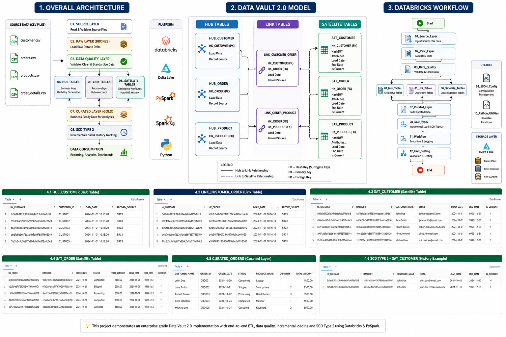
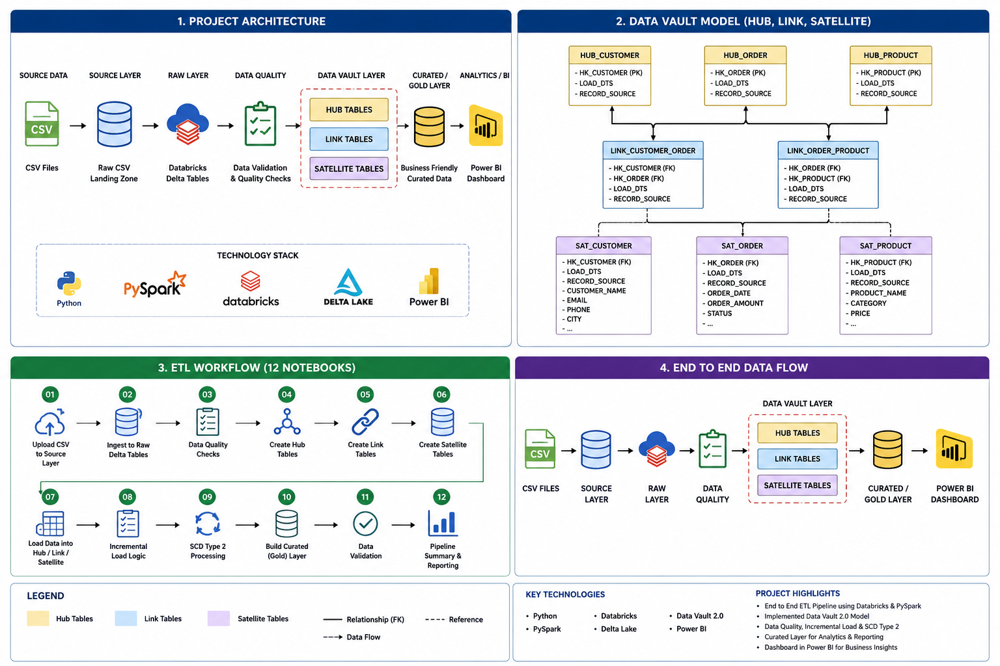
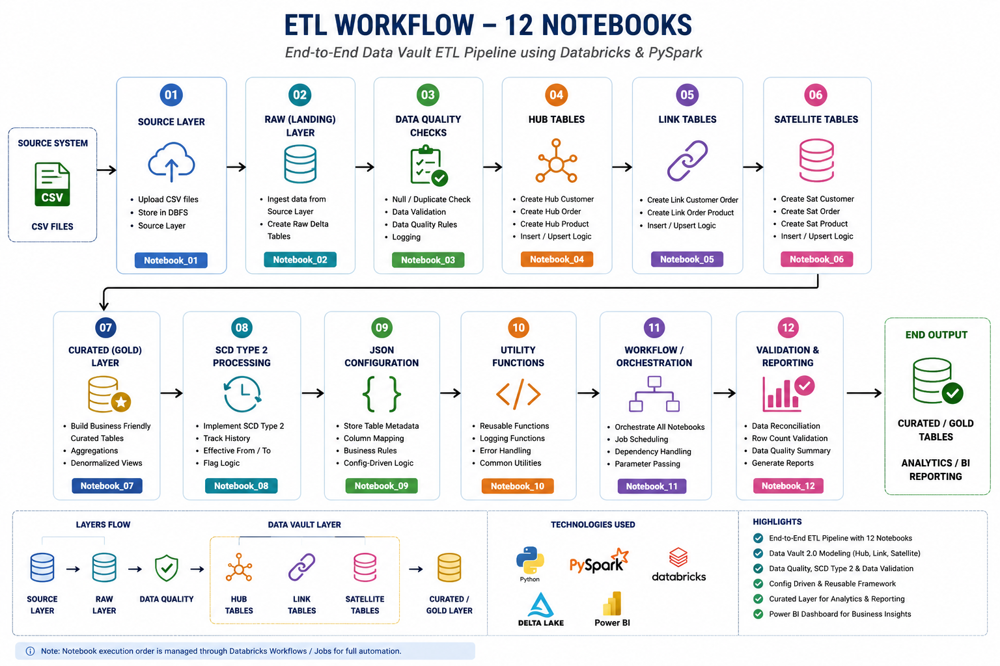
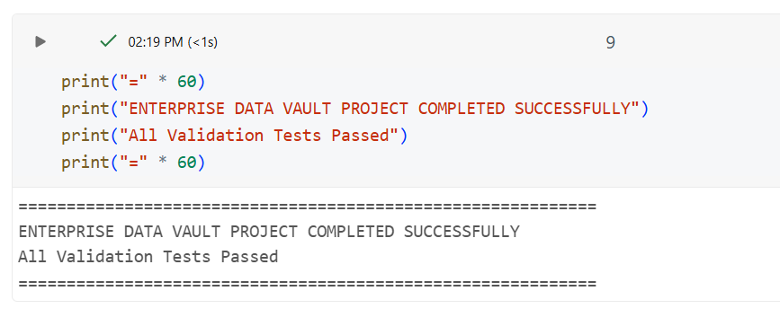

# Enterprise Data Vault ETL Pipeline using Databricks, PySpark & Delta Lake

## Project Overview

This project demonstrates an end-to-end Enterprise ETL pipeline built using **Databricks**, **PySpark**, **Spark SQL**, **Delta Lake**, and **Data Vault 2.0**.

The pipeline ingests Customer, Orders, Products, and Order Details data, performs data quality validation, builds a Data Vault model (Hub, Link, and Satellite tables), creates curated datasets for reporting, and implements **Slowly Changing Dimension (SCD) Type 2** to maintain historical records.

The project also includes configuration-driven ETL using JSON, reusable Python utility functions, workflow orchestration, and validation testing.

---

# Business Problem

Organizations receive data from multiple operational systems. This data needs to be:

- Cleaned and validated
- Integrated from multiple sources
- Stored with complete historical tracking
- Made available for reporting and analytics

This project demonstrates how Data Vault 2.0 can be used to build a scalable and maintainable enterprise data warehouse.

---

# Project Architecture

```
                    Source Files (CSV)
          -------------------------------------
          Customer | Orders | Products | Order Details
                           |
                           ▼
                    Source Layer
                           |
                           ▼
                  Raw Layer (Bronze)
                           |
                           ▼
                 Data Quality Validation
                           |
        ┌──────────────────┼──────────────────┐
        ▼                  ▼                  ▼
    Hub Tables         Link Tables      Satellite Tables
        │                  │                  │
        └──────────────────┼──────────────────┘
                           ▼
                   Curated Layer (Gold)
                           |
                           ▼
               SCD Type 2 Incremental Load
                           |
                           ▼
                  Reporting & Analytics
```

---


## Project Architecture




# Data Vault Model




# ETL Workflow

The following diagram illustrates the execution flow of the complete Enterprise Data Vault ETL pipeline developed in Databricks using 12 notebooks.




## ✅ Final Validation Result

The Enterprise Data Vault ETL pipeline executed successfully, and all validation tests passed. This confirms that the data quality checks, Data Vault tables, SCD Type 2 implementation, and curated layer were successfully validated.




# Technologies Used

| Technology | Purpose |
|------------|---------|
| Databricks Community Edition | Data Engineering Platform |
| PySpark | Data Processing |
| Spark SQL | Data Transformation |
| Delta Lake | Storage Layer |
| Python | ETL Development |
| Data Vault 2.0 | Data Warehouse Modeling |
| GitHub | Version Control |
| JSON | Configuration Management |

---

# Dataset Information

The project uses four datasets.

| Dataset | Description |
|----------|-------------|
| Customer | Customer master data |
| Orders | Customer order information |
| Products | Product master data |
| Order Details | Product-wise transaction details |

---

# Project Structure

```
Enterprise-DataVault-ETL-using-Databricks-PySpark/

├── notebooks/
│   ├── 01_Source_Layer.py
│   ├── 02_Raw_Layer.py
│   ├── 03_Data_Quality.py
│   ├── 04_Hub_Tables.py
│   ├── 05_Link_Tables.py
│   ├── 06_Satellite_Tables.py
│   ├── 07_Curated_Layer.py
│   ├── 08_SCD_Type2.py
│   ├── 09_JSON_Config.py
│   ├── 10_Python_Utilities.py
│   ├── 11_Workflow.py
│   └── 12_Unit_Testing.py

├── datasets/
│   ├── customer.csv
│   ├── orders.csv
│   ├── products.csv
│   └── order_details.csv

├── images/

└── README.md
```

---

# ETL Pipeline

### Notebook 01 – Source Layer
- Read source CSV files
- Validate file structure
- Create source DataFrames

### Notebook 02 – Raw Layer
- Load raw data into Delta tables
- Store source data without modifications

### Notebook 03 – Data Quality
- Remove duplicates
- Handle null values
- Standardize data
- Validate records

### Notebook 04 – Hub Tables
- Generate Hash Keys
- Create Hub Customer
- Create Hub Order
- Create Hub Product

### Notebook 05 – Link Tables
- Build relationships between Hub tables
- Customer ↔ Order
- Order ↔ Product

### Notebook 06 – Satellite Tables
- Store descriptive attributes
- Generate HashDiff
- Track historical changes

### Notebook 07 – Curated Layer
- Join Hub, Link and Satellite tables
- Build reporting-ready dataset

### Notebook 08 – SCD Type 2
- Detect changed records
- Preserve historical versions
- Maintain current records

### Notebook 09 – JSON Configuration
- Configuration-driven ETL
- Dynamic source and target tables
- Reusable pipeline

### Notebook 10 – Python Utility Functions
- Hash Key generation
- HashDiff generation
- Email validation
- Name standardization

### Notebook 11 – Workflow
- Job orchestration
- Execution logging
- Table validation

### Notebook 12 – Unit Testing & Validation
- Row count validation
- Null checks
- Duplicate checks
- Hash Key validation
- SCD validation

---

# Data Vault Model

## Hub Tables
- Hub Customer
- Hub Order
- Hub Product

## Link Tables
- Link Customer Order
- Link Order Product

## Satellite Tables
- Satellite Customer
- Satellite Order
- Satellite Product

---

# Key Features

- Enterprise Data Vault 2.0 Implementation
- End-to-End ETL Pipeline
- PySpark Transformations
- Spark SQL Queries
- Delta Lake Storage
- Hash Key Generation
- HashDiff Calculation
- Slowly Changing Dimension (SCD Type 2)
- JSON Configuration
- Incremental Loading
- Workflow Simulation
- Data Validation
- Unit Testing

---

# Validation Performed

- Row Count Validation
- Duplicate Record Validation
- Null Value Validation
- Primary Key Validation
- Hash Key Validation
- SCD Type 2 Validation

---

# Future Enhancements

- Azure Data Factory Integration
- Azure Data Lake Storage Gen2
- Unity Catalog
- Delta Live Tables
- Auto Loader
- Structured Streaming with Kafka
- CI/CD using Azure DevOps
- Power BI Dashboard

---

# Learning Outcomes

This project helped strengthen skills in:

- Data Engineering
- PySpark
- Spark SQL
- Delta Lake
- Data Vault 2.0
- ETL Design
- Incremental Loading
- Data Quality
- GitHub
- Databricks

---

# Author

**Soubhagya Shankargouda**

Computer Science Engineer |  Data Engineer

GitHub:
https://github.com/soubhagyashankargouda

# License

This project is created for learning and portfolio purposes.
